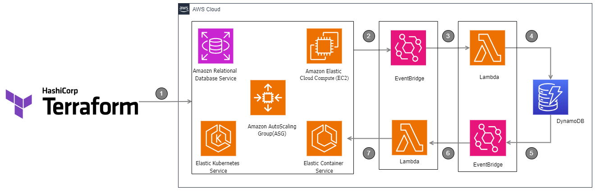

# ec2-autoscheduler-terraform

## Introduction

`ec2-autoscheduler-terraform` is a Terraform module designed to automate the scheduling of EC2 instances. This module helps in reducing costs by starting and stopping instances based on a predefined schedule.

## Features

- Automated start and stop of EC2 instances.
- Customizable schedules.
- Easy integration with existing Terraform configurations.

## Prerequisites

- Terraform installed on your local machine.
- AWS CLI configured with appropriate permissions.
- An AWS account.

## Installation

1. Clone the repository:
   ```sh
   git clone git@github.com:Radhi-Hudijan/ec2-autoscheduler-terraform.git
   cd ec2-autoscheduler-terraform
   ```
2. Initialize Terraform:
   ```sh
   terraform init
   ```
3. Apply the Terraform configuration:
   ```sh
   terraform apply
   ```

## Usage

1. Define your schedule in the `variables.tf` file.
2. Run the Terraform apply command to set up the scheduler:
   ```sh
   terraform apply
   ```

## Diagram



## Contributing

1. Fork the repository.
2. Create a new branch (`git checkout -b feature-branch`).
3. Commit your changes (`git commit -am 'Add new feature'`).
4. Push to the branch (`git push origin feature-branch`).
5. Create a new Pull Request.

## Contact

For any questions or support, please contact:

- **Name**: Radhi Hudijan
- **GitHub**: [Radhi-Hudijan](https://github.com/Radhi-Hudijan)

Feel free to reach out if you have any issues or suggestions.
